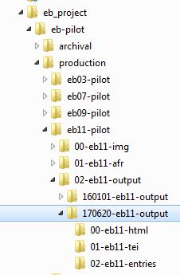
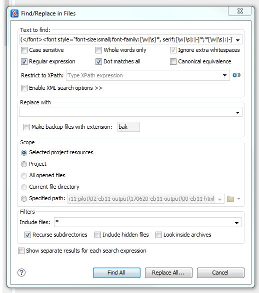
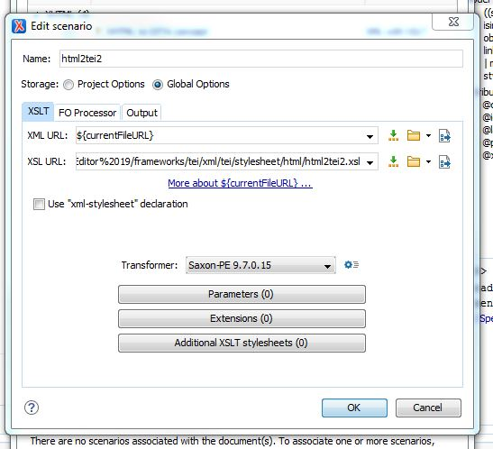
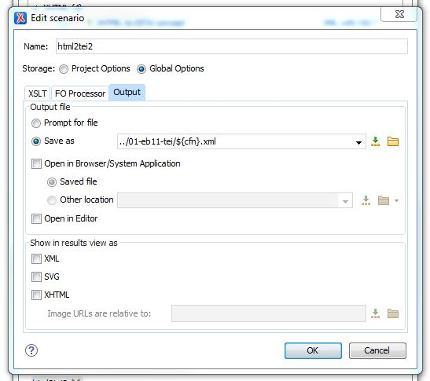

## Converting HTML to TEI-XML
22 June 2017  

**To convert Abbyy’s html files to TEI-xml, use the following procedure in Oxygen.**

### 1. Create a New Project

1.	Navigate to the directory for the output you are working on, such as `eb11-pilot/02-eb11-output/170620-eb11-output/`
2.	Create a New Project for that directory
3.	The directory should have the html files contained in a folder named `00-ebnn-html`. 
4.	Iff they do not already exist, add two new folders to the directory:
`01-ebnn-tei` and `02-ebnn-entries`. 

### 2. Check the html files for well-formedness

Documents must be “well-formed” for Oxygen to transform them. Note that being well-formed is not the same thing as validating, and we do not need to validate these files—we only need them to pass the check for well-formedness. 

Abbyy has a consistent problem with improperly nested `` and `` tags, and this violates the rules of well-formedness. They should be wholly contained within the `` tags, like this: `xyz`, but Abby misorders them as follows: `xyz`.  To correct this error, we run a batch find-and-replace operation that reorders the tags.

1.	Select a batch of html files in the project window. (50 seems to work well.)
2.	Right-click the selection and open the *Find/Replace in Files …* window.
3.	Enter the following regex as the *Text to find*: `()(\w*</su.>)` 
4.	Please note that the expression `[\w|\s|:|-]*;` finds additional font attrtibutes. In some cases you may want to modify the regex to accommodate more of these. 
5.	Replace with: `\2\1` 
6.	Select the *Regular expression* and *Dot matches all* boxes. For *Scope*, use *Selected project resources*.
7.	*Replace all…* gives you the option to *Preview…* changes. Double check one or two to make sure the regex is working properly, then click *OK*.
8.	When all files are done, selected the html folder, right-click, and select *Validate/Check well-formedness*. All files should be well-formed. If not, correct any remaining problems manually before proceeding.

### 3. Transform the html files

Work in batches again, using the `html2tei2` script.

1.	Select a batch of html files, right-click them, and select *Transform/Configure transformation scenarios…*
2.	In the window that opens, select `html2tei2` under *Global*. **Skip to step #8**.
3.	If `html2tei2` is not visible, select *New/XML Transformation with XSLT*. Name the new scenario `html2tei2`. 
4.	On the *XSLT tab*, for *XSL URL:* click the folder icon and navigate to `C:\Program Files\Oxygen XML Editor 19\frameworks\tei\xml\tei\stylesheet\html`. Select `html2tei2.xsl`. 
5.	Change Transformer to *Saxon-PE 9.7.0.x*.
6.	On the *Output* tab, Save as: `../01-ebnn-tei/${cfn}.xml`. This saves the file in the tei folder using the original filename with an xml extension.
7.	Uncheck *Show in results view as: XML*.
8.	Click *Apply Associated* to run the scenario on the selected files and save the results in the tei output folder.
9.	Any files that are not well-formed will not be transformed. Instead, they will show up in the *Batch validation problems* sub-window, at the bottom of the Oxygen application window. 
10.	Open the file(s) and correct any problems before rerunning the scenario on the file.
11.	Validate all files in the `01-ebnn-tei` folder. The transformation is complete.

